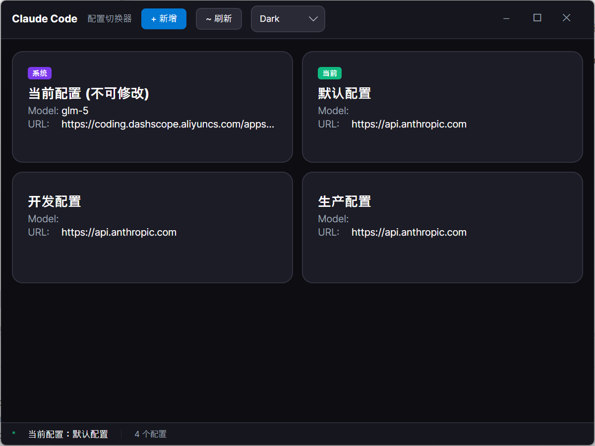

# Claude Code Switch

[](https://github.com/chuccp/claude-code-switch/releases)
[](https://github.com/chuccp/claude-code-switch/releases)
[](https://github.com/chuccp/claude-code-switch/stargazers)
[](LICENSE)
[](https://github.com/chuccp/claude-code-switch/releases)
[](https://dotnet.microsoft.com/)
[](https://docs.microsoft.com/en-us/dotnet/csharp/)

[简体中文](README.zh-CN.md) | [繁體中文](README.zh-TW.md) | [English](README.md)

A cross-platform desktop application based on Avalonia UI.

## Download

Download the latest version from [GitHub Releases](https://github.com/chuccp/claude-code-switch/releases).

> **Note for Mac and Linux users:**
> - **Linux**: Run `chmod +x claude-code-switch` to grant execute permission.
> - **macOS**: The app is packaged as a `.app` bundle. On first launch, you may need to go to `System Preferences > Privacy & Security` and click "Open Anyway" to allow the app to run.

## Screenshots



## Tech Stack

- **.NET 10.0**
- **Avalonia UI 11.1.3** - Cross-platform UI framework
- **Avalonia ReactiveUI** - Reactive UI pattern
- **Tomlyn** - TOML configuration file parsing

## Features

- 🎨 **Fluent Design Theme** - Modern UI style
- 🌙 **Dark/Light Theme Switch** - Theme switching support
- 📱 **Cross-platform Support** - Windows, Linux, macOS
- 🔧 **Configurable Window Settings** - Customizable window size and position

## Project Structure

```
claude-code-switch/
├── Controls/          # Custom controls
├── Converters/        # Data converters
├── Models/            # Data models
├── Services/          # Service layer
├── Theme/             # Theme styles
├── ViewModels/        # View models
├── Views/             # View pages
└── Program.cs         # Application entry point
```

## Requirements

- .NET 10.0 SDK
- IDE with Avalonia UI support (Visual Studio, Rider, or VS Code)

## Build & Run

```bash
# Restore dependencies
dotnet restore

# Build project
dotnet build

# Run application
dotnet run --project claude-code-switch/claude-code-switch.csproj
```

## Configuration

The application uses `appl.toml` for configuration:

```toml
debug_mode = false
theme = "Dark"
[window]
width = 800
height = 600
x = 1320
y = 594
[dialog]
width = 700
height = 550
```

## License

This project is licensed under the MIT License. See [LICENSE](LICENSE) file for details.
